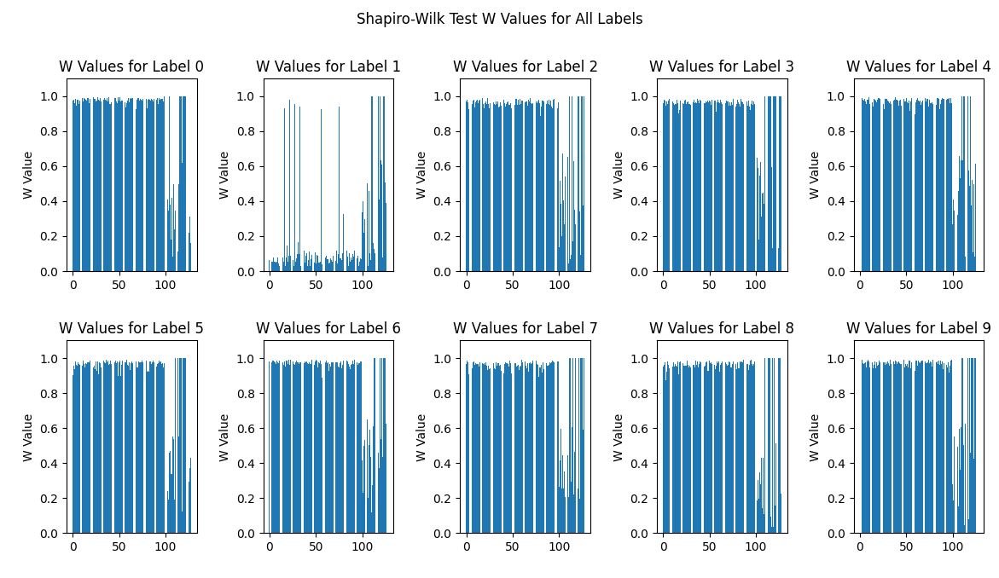
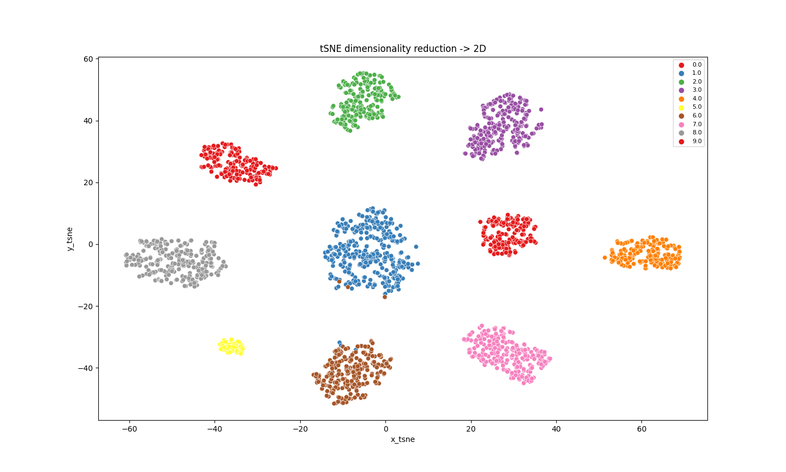

## INFS4203 Data Mining project @ UQ


TODO:
- [x] Data preprocessing   
- [ ] Making another way of detecting anomalies for the class 'car'. Given that it doesn't follow a normal distribution. 
- [x] Creating k-NN classifier with k-fold CV.
- [x] Creating k-means classifier with k-fold CV.
- [x] Creating decision tree classifier with k-fold CV.
- [x] Creating random forest classifier with k-fold CV.

## Prerequisites
- **Poetry**: This project uses Poetry with Python=3.11 (pyenv) for dependency management. Dependencies is listed in pyproject.toml
- **Data Directory**: In order for the get_data_dir() function to work properly you will ned a .env file in the root of your repository with the following information:
   ```
    REPO_DATA_DIR="path to data directory where train and test.csv files are present"
   ```
## Getting Started

1. **Install Poetry (if you haven't already)**:

   Detailed instructions for various operating systems can be found at [Poetry's installation documentation](https://python-poetry.org/docs/#installation). The following instructions are for macOS and Linux.
     ```bash
     curl -sSL https://install.python-poetry.org | bash
     ```

2. **Clone this repository**:

   ```bash
   git clone git@github.com:larsmoan/INFS4203.git
   cd INFS4203
   ```

3. **Install dependencies**:

   ```bash
   poetry install
   ```

## Usage

1. **Activate the virtual environment**:

   ```bash
   poetry shell
   ```

2. **Run the main classification:**:

   ```bash
   python classification.py
   ```


## Results and findings
Based on inspecting the class specific distributions it seems that the class 'car' is not normally distributed. This poses a problem since the outlier detection is done by assuming a Gaussian distribution of the data. 



Another interesting finding was how tSNE was able to reduce the dimensionality reduction -> 2D so well. 



# Model results
From the initial training I tested out k-NN, k-means, decision tree and random forest.
Decision tree performed so poorly that I haven't included it in the results.

### The results was obtained using the other training set: train2.csv as a completely unseen testset, but with labels.

## Classification reports:
RandomForest classifier 

| Class | Precision | Recall | F1-Score | Support |
|-------|-----------|--------|----------|---------|
| 0.0   | 0.93      | 0.97   | 0.95     | 207     |
| 1.0   | 0.98      | 0.97   | 0.98     | 204     |
| 2.0   | 0.98      | 0.93   | 0.96     | 194     |
| 3.0   | 0.94      | 0.91   | 0.93     | 280     |
| 4.0   | 0.93      | 0.97   | 0.95     | 187     |
| 5.0   | 0.79      | 0.85   | 0.82     | 99      |
| 6.0   | 0.98      | 0.99   | 0.99     | 217     |
| 7.0   | 0.99      | 0.99   | 0.99     | 189     |
| 8.0   | 0.94      | 0.94   | 0.94     | 159     |
| 9.0   | 0.96      | 0.95   | 0.95     | 144     |
|       |           |        |          |         |
| **Accuracy** |            |        | 0.95         |  1880   |
| **Macro Avg** | 0.94      | 0.95   | **0.94**     | 1880    |
| **Weighted Avg** | 0.95   | 0.95   | 0.95     | 1880    |


KMeans classifier 
| Class | Precision | Recall | F1-Score | Support |
|-------|-----------|--------|----------|---------|
| 0.0   | 0.82      | 0.83   | 0.82     | 207     |
| 1.0   | 0.81      | 0.76   | 0.78     | 204     |
| 2.0   | 0.80      | 0.73   | 0.76     | 194     |
| 3.0   | 0.84      | 0.80   | 0.82     | 280     |
| 4.0   | 0.84      | 0.85   | 0.84     | 187     |
| 5.0   | 0.47      | 0.51   | 0.49     | 99      |
| 6.0   | 0.81      | 0.74   | 0.77     | 217     |
| 7.0   | 0.93      | 0.98   | 0.96     | 189     |
| 8.0   | 0.81      | 0.69   | 0.74     | 159     |
| 9.0   | 0.67      | 0.96   | 0.79     | 144     |
|       |           |        |          |         |
| **Accuracy** |            |        | ***0.79***     | 1880    |
| **Macro Avg** | 0.78      | 0.78   | 0.78     | 1880    |
| **Weighted Avg** | 0.80   | 0.79   | 0.79     | 1880    |


KNN classifier 
   | Class | Precision | Recall | F1-Score | Support |
|-------|-----------|--------|----------|---------|
| 0.0   | 0.84      | 0.78   | 0.81     | 207     |
| 1.0   | 0.32      | 0.84   | 0.46     | 204     |
| 2.0   | 0.73      | 0.41   | 0.53     | 194     |
| 3.0   | 0.91      | 0.72   | 0.81     | 280     |
| 4.0   | 0.87      | 0.80   | 0.83     | 187     |
| 5.0   | 0.44      | 0.31   | 0.36     | 99      |
| 6.0   | 0.78      | 0.47   | 0.59     | 217     |
| 7.0   | 0.94      | 0.81   | 0.87     | 189     |
| 8.0   | 0.89      | 0.58   | 0.70     | 159     |
| 9.0   | 0.79      | 0.96   | 0.87     | 144     |
|       |           |        |          |         |
| **Accuracy** |            |        | ***0.68***     | 1880    |
| **Macro Avg** | 0.75      | 0.67   | 0.68     | 1880    |
| **Weighted Avg** | 0.77   | 0.68   | 0.70     | 1880    |


