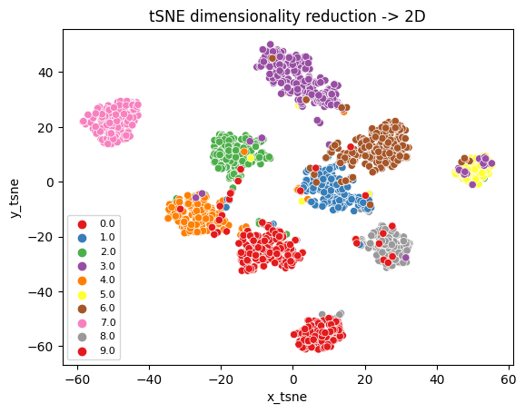

## INFS4203 Data Mining project @ UQ

TODO:
- [x] Data preprocessing   
- [ ] Making another way of detecting anomalies for the class 'car'. Given that it doesn't follow a normal distribution. 
- [x] Creating k-NN classifier with k-fold CV.
- [x] Creating k-means classifier with k-fold CV.
- [x] Creating decision tree classifier with k-fold CV.
- [x] Creating random forest classifier with k-fold CV.

## Prerequisites
- **Poetry**: This project uses Poetry with Python=3.11 (pyenv) for dependency management. Dependencies is listed in pyproject.toml
- **Data Directory**: In order for the get_data_dir() function to work properly you will ned a .env file in the root of your repository with the following information:
   ```
    REPO_DATA_DIR="path to data directory where train and test.csv files are present"
   ```
## Getting Started

1. **Install Poetry (if you haven't already)**:

   Detailed instructions for various operating systems can be found at [Poetry's installation documentation](https://python-poetry.org/docs/#installation). The following instructions are for macOS and Linux.
     ```bash
     curl -sSL https://install.python-poetry.org | bash
     ```

2. **Clone this repository**:

   ```bash
   git clone git@github.com:larsmoan/INFS4203.git
   cd INFS4203
   ```

3. **Install dependencies**:

   ```bash
   poetry install
   ```

## Usage

1. **Activate the virtual environment**:

   ```bash
   poetry shell
   ```

2. **Run the main classification:**:

   ```bash
   python classification.py
   ```
3. **Reproduce the hyperparameter search:**:
   ```bash
   python hyperparameter_tuning.py
   ```

## Dataset
The data used in this project can be found in the data/ folder. It is anynomized, but said to come from CIFAR-10 but with a lot of preprocessing from the teaching staff, such as removing values and adding outliers.

Each sample consist of a *128-dimensional* feature vector, each having a label from 0-9.

| Label Number | Actual Label |
|--------------|--------------|
| 0            | airplane     |
| 1            | car          |
| 2            | bird         |
| 3            | cat          |
| 4            | deer         |
| 5            | dog          |
| 6            | frog         |
| 7            | horse        |
| 8            | ship         |
| 9            | truck        |

### Original dataset: train.csv
This dataset consists of 2180 entries 

### Secondary dataset: train2.csv
This dataset was released from the teaching staff midway in the project and conists of 1880 entries of the same size as the original dataset.
However from inspecting both of them it seems that the second dataset has a lot more inherent complexity present.
This can be seen when reducing the dimensionality of the dataset from 128 -> 2 using tSNE (not part of the curriculum).


<figure style="margin-right: 10px; display: inline-block;">
   
   <figcaption>tSNE on the original dataset</figcaption>
</figure>

<figure style="margin-right: 10px; display: inline-block;">
   
   <figcaption>tSNE on the secondary dataset</figcaption>
</figure>

<figure style="display: inline-block;">
   
   <figcaption>tSNE on the joint dataset of the original + secondary</figcaption>
</figure>


***Another finding when comparing the datasets is how closely each class specific feature follows a gaussian distribution.***

<figure style="margin-right: 10px; display: inline-block;">
  
  <figcaption>Shapiro-Wilkes test on the original dataset</figcaption>
</figure>

<figure style="margin-right: 10px; display: inline-block;">
  
  <figcaption>Shapiro-Wilkes test on the secondary dataset</figcaption>
</figure>

<figure style="display: inline-block;">
  
  <figcaption>Shapiro-Wilkes test on the joint dataset</figcaption>
</figure>


# Model results
From the initial training I tested out k-NN, k-means, decision tree and random forest.
Decision tree performed so poorly that I haven't included it in the results.

### The results below was obtained using the combination of train and train2 as training set whilst using 20% of this as validation data that was not seen when the models were fitted.

## Classification reports:
| Classification report for: RandomForest classifier | precision | recall | f1-score | support |
|---------------------------------------------------|-----------|--------|----------|---------|
| 0.0                                               |   0.92    |  0.98  |   0.95   |    56   |
| 1.0                                               |   0.99    |  0.99  |   0.99   |    86   |
| 2.0                                               |   1.00    |  0.93  |   0.97   |    61   |
| 3.0                                               |   0.97    |  0.96  |   0.97   |    81   |
| 4.0                                               |   0.95    |  0.96  |   0.95   |    55   |
| 5.0                                               |   0.88    |  1.00  |   0.94   |    22   |
| 6.0                                               |   0.97    |  1.00  |   0.99   |    69   |
| 7.0                                               |   1.00    |  0.98  |   0.99   |    65   |
| 8.0                                               |   0.98    |  0.95  |   0.97   |    65   |
| 9.0                                               |   0.98    |  0.94  |   0.96   |    49   |
| accuracy                                          |           |        |   0.97   |   609   |
| macro avg                                        |   0.96    |  0.97  |   ***0.97***   |   609   |
| weighted avg                                     |   0.97    |  0.97  |   0.97   |   609   |


| Classification report for: KMeans classifier | precision | recall | f1-score | support |
|---------------------------------------------|-----------|--------|----------|---------|
| 0.0                                         |   0.96    |  0.96  |   0.96   |    56   |
| 1.0                                         |   0.96    |  0.78  |   0.86   |    86   |
| 2.0                                         |   0.84    |  0.95  |   0.89   |    61   |
| 3.0                                         |   0.93    |  0.96  |   0.95   |    81   |
| 4.0                                         |   0.79    |  0.96  |   0.87   |    55   |
| 5.0                                         |   0.69    |  1.00  |   0.81   |    22   |
| 6.0                                         |   0.94    |  0.70  |   0.80   |    69   |
| 7.0                                         |   1.00    |  0.98  |   0.99   |    65   |
| 8.0                                         |   0.95    |  0.97  |   0.96   |    65   |
| 9.0                                         |   0.92    |  0.94  |   0.93   |    49   |
| accuracy                                    |           |        |   0.91   |   609   |
| macro avg                                  |   0.90    |  0.92  |   ***0.90***   |   609   |
| weighted avg                               |   0.92    |  0.91  |   0.91   |   609   |

| Classification report for: KNN classifier | precision | recall | f1-score | support |
|------------------------------------------|-----------|--------|----------|---------|
| 0.0                                      |   0.97    |  1.00  |   0.98   |    56   |
| 1.0                                      |   0.99    |  0.99  |   0.99   |    86   |
| 2.0                                      |   1.00    |  0.93  |   0.97   |    61   |
| 3.0                                      |   0.98    |  0.99  |   0.98   |    81   |
| 4.0                                      |   0.95    |  0.96  |   0.95   |    55   |
| 5.0                                      |   0.96    |  1.00  |   0.98   |    22   |
| 6.0                                      |   0.99    |  1.00  |   0.99   |    69   |
| 7.0                                      |   1.00    |  0.98  |   0.99   |    65   |
| 8.0                                      |   0.98    |  0.97  |   0.98   |    65   |
| 9.0                                      |   0.96    |  0.96  |   0.96   |    49   |
| accuracy                                 |           |        |   0.98   |   609   |
| macro avg                               |   0.98    |  0.98  |   ***0.98***   |   609   |
| weighted avg                            |   0.98    |  0.98  |   0.98   |   609   |


***During the project process I did numerous different train / val splits and RandomForest seemed to generally always perform better on completely unseen data. Especially when it was fitted on the original dataset (train.csv) and validated on the second dataset (train2.csv). Therefore RandomForest was chosen as the classifier used on the testset and generated the results for the final report.***